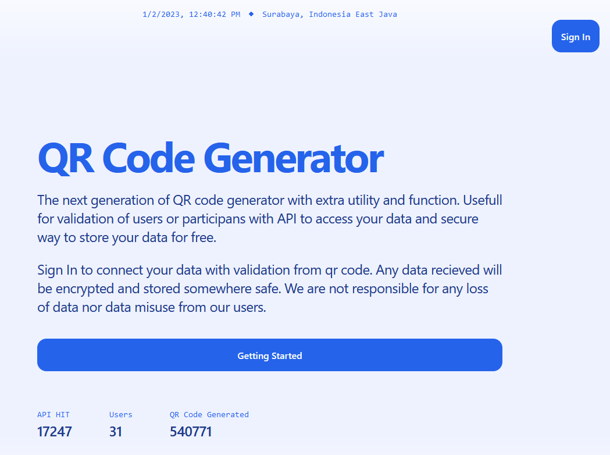
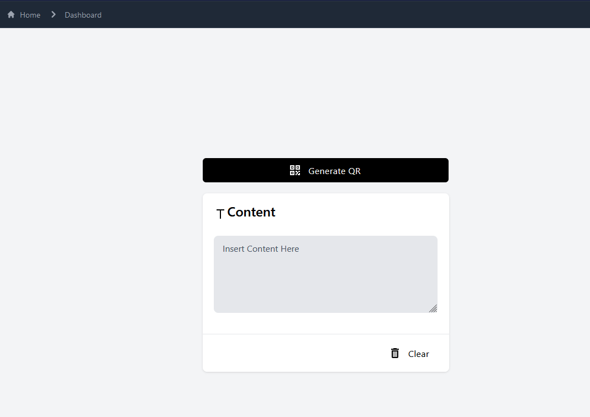

# Introduction
QR Code Generator with UI
- [Remix Docs](https://remix.run/docs)

# Images
Home Screen


Generator Screen


## Development

From your terminal:

```sh
npm run dev
```

This starts your app in development mode, rebuilding assets on file changes.

## Deployment

Using Docker
```sh
docker run -p 3000:3000 --rm j3rr7/qr-gen-web:v1
```

First, build your app for production:

```sh
npm run build
```

Then run the app in production mode:

```sh
npm start
```

Now you'll need to pick a host to deploy it to.